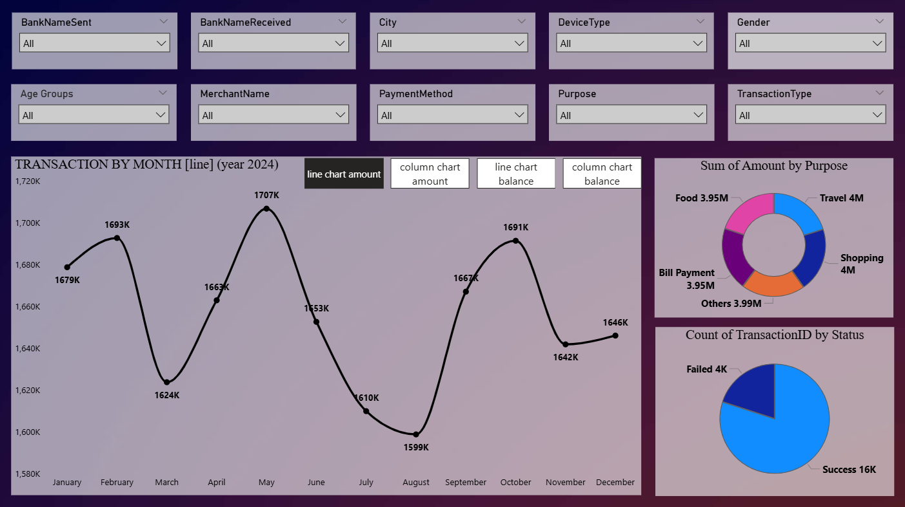
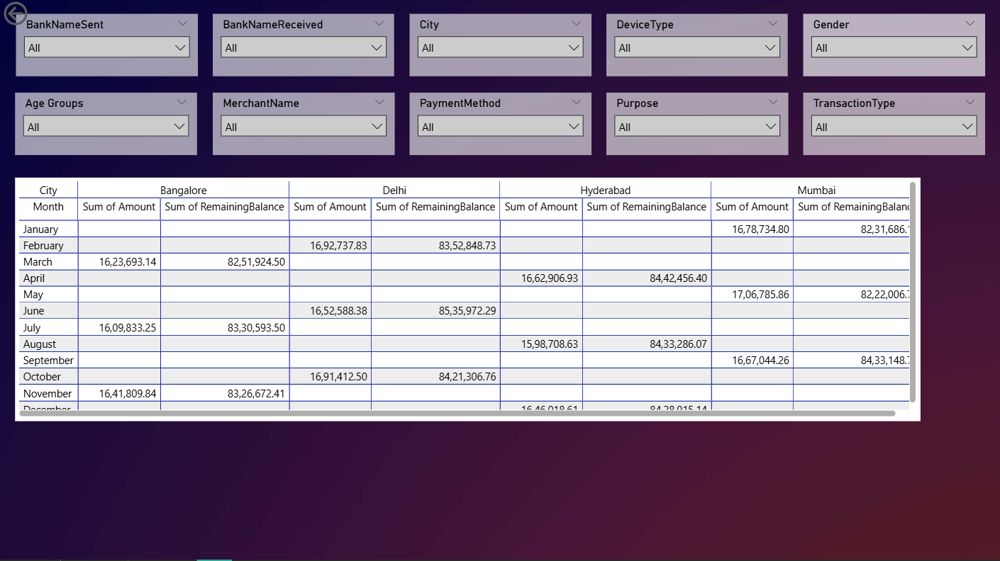

#  UPI Transactions Analysis — Power BI Dashboard

> End-to-end data analytics project covering SQL data cleaning, data profiling, exploratory analysis, DAX measures, and an interactive Power BI dashboard built on 20,000 real-world UPI transaction records from 2024.

---

##  Project Overview

This project simulates the complete workflow of a **data analyst** working on a financial transactions dataset:

- Raw Excel data → SQL Server for cleaning & exploration
- Cleaned data → Power BI for visual storytelling
- DAX measures for KPIs and dynamic calculations
- Written insights for business stakeholders

---

##  Repository Structure

```
upi-transactions-powerbi/
│
├── data/
│   └── UPI_Transactions.xlsx          ← Raw dataset (20,000 rows, 20 columns)
│
├── sql/
│   ├── 01_data_cleaning.sql           ← Null checks, duplicates, type validation
│   ├── 02_data_profiling.sql          ← Min, Max, Mean, Median, Mode, SD per column
│   ├── 03_data_exploration.sql        ← 15 business queries with results
│   └── 04_dax_measures.dax            ← All DAX measures used in Power BI
│
├── powerbi/
│   └── Transaction_analysis.pbix      ← Power BI dashboard file
│
├── insights/
│   └── insights.md                    ← 10 data-driven business insights
│
└── README.md
```

---

## Dataset Details

| Property | Value |
|---|---|
| **Source** | Synthetic UPI Transaction Data |
| **Records** | 20,000 |
| **Columns** | 20 |
| **Time Period** | January 2024 – December 2024 |
| **Cities** | Delhi, Mumbai, Bangalore, Hyderabad |
| **Banks** | SBI, HDFC, ICICI, Axis |
| **Merchants** | Amazon, Flipkart, Zomato, Swiggy, IRCTC |

### Columns at a Glance
`TransactionID` · `TransactionDate` · `Amount` · `BankNameSent` · `BankNameReceived` · `RemainingBalance` · `City` · `Gender` · `TransactionType` · `Status` · `TransactionTime` · `DeviceType` · `PaymentMethod` · `MerchantName` · `Purpose` · `CustomerAge` · `PaymentMode` · `Currency` · `CustomerAccountNumber` · `MerchantAccountNumber`

---

##  Tools & Technologies

| Tool | Purpose |
|---|---|
| **Microsoft SQL Server (SSMS)** | Data cleaning, profiling, and exploration |
| **Power BI Desktop** | Dashboard, visuals, and DAX measures |
| **Microsoft Excel** | Raw data source |
| **GitHub** | Version control and project showcase |

---

##  Data Cleaning Summary (`01_data_cleaning.sql`)

| Check | Result |
|---|---|
| Total Records | 20,000 |
| Null Values |  0 across all 20 columns |
| Duplicate Transaction IDs |  0 duplicates |
| Negative / Zero Amounts |  0 invalid amounts |
| Invalid Date Range |  All within Jan–Dec 2024 |
| Inconsistent Status Values |  Only 'Success' and 'Failed' |
| Whitespace in Text Columns |  Trimmed via LTRIM/RTRIM |

**Derived Columns Added:**
- `TransactionMonth` — for monthly trend analysis
- `AgeGroup` — buckets: 20–29, 30–39, 40–49, 50–59
- `IsHighValue` — BIT flag for Amount > 1,500

---

##  Key Business Metrics

| KPI | Value |
|---|---|
| Total Transactions | 20,000 |
| Total Transaction Value | ₹1,98,72,274 |
| Average Transaction Value | ₹993.61 |
| **Success Rate** | **80%** (16,000 transactions) |
| **Failure Rate** | **20%** (4,000 transactions) |
| Total Failed Amount | ₹39,96,787 |
| High Value Transactions (>₹1,500) | 4,940 (24.7%) |
| High Value % of Revenue | 43.5% |

---

##  Top Insights

1. **1 in 5 transactions fails** — ₹40 lakh in value blocked. All 4 banks show identical 20% failure rate, pointing to a platform-side issue.
2. **Mumbai & Delhi lead** — highest average spend per transaction (₹1,007–₹1,010 vs ₹975–₹981 in other cities).
3. **Age 40–49 spends the most** — ₹1,002 avg vs ₹985 for 20–29 age group.
4. **Top 25% of transactions = 43.5% of revenue** — high-value users must be protected.
5. **Travel & Shopping** drive the highest average spend (₹999+) while Food is the lowest (₹986).

---

##  DAX Measures Highlights (`04_dax_measures.dax`)

```dax
Success Rate % = 
DIVIDE(
    CALCULATE(COUNT(UPI_Transactions[TransactionID]), UPI_Transactions[Status] = "Success"),
    COUNT(UPI_Transactions[TransactionID]), 0
) * 100

Month over Month Growth % = 
VAR CurrentMonthAmount = CALCULATE(SUM(UPI_Transactions[Amount]), DATESMTD(UPI_Transactions[TransactionDate]))
VAR PreviousMonthAmount = CALCULATE(SUM(UPI_Transactions[Amount]), DATEADD(UPI_Transactions[TransactionDate], -1, MONTH))
RETURN DIVIDE(CurrentMonthAmount - PreviousMonthAmount, PreviousMonthAmount, 0) * 100

High Value % of Amount = 
DIVIDE(
    CALCULATE(SUM(UPI_Transactions[Amount]), UPI_Transactions[Amount] > 1500),
    SUM(UPI_Transactions[Amount]), 0
) * 100
```
---

##  Power BI Dashboard

## Power BI Dashboard

**2-Page Dashboard with Bookmarks**

### Page 1 — Transaction Overview



- Donut Chart — Transaction Status breakdown (Success vs Failed)
- Pie Chart — Transactions by Purpose (Food, Travel, Shopping, Bill Pay, Others)
- KPI Cards — Total Amount, Success Rate, Failure Rate, Avg Transaction Value
- Bookmarks — toggle between Success-only and All Transactions view

### Page 2 — Detailed Matrix Analysis



- Matrix Table — Cross-tab of City x Purpose x PaymentMode with Amount totals
- Drill-through enabled on City and Merchant
- Conditional formatting on failure rate column
##  How to Run This Project

### SQL (SSMS)
1. Import `data/UPI_Transactions.xlsx` into SQL Server
2. Run scripts in order: `01` → `02` → `03`
3. Review profiling output from `02_data_profiling.sql`
4. Explore business questions from `03_data_exploration.sql`

### Power BI
1. Open `powerbi/Transaction_analysis.pbix` in Power BI Desktop
2. Update data source path to your local Excel file
3. Refresh data — all visuals and DAX measures auto-populate
4. Use bookmarks on Page 1 to toggle views

---

##  Author

**Atharva Mohite**  
B.Tech Student — DY Patil University (RAIT), Expected 2027  
Specialisation: Machine Learning · Data Science · NLP  
GATE 2026 Qualified — Data Science & AI (AIR 7007)


---
